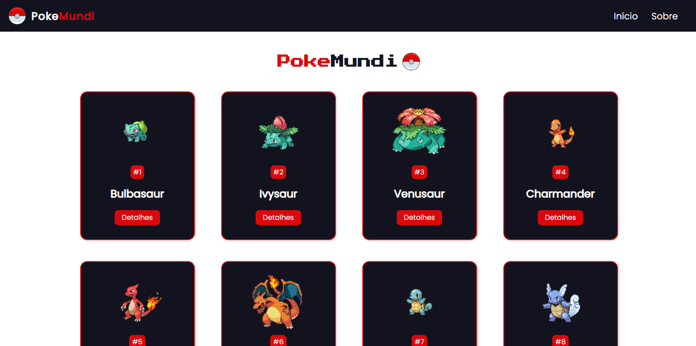

# PokeMundi 🔴

You can access it with this [link.](https://pokemundi-project.vercel.app/)

# 💻 About the project 
My project uses Next.js to create an interactive and responsive web application. Through integration with a Pokémon API, it offers users the possibility to obtain related information about different species such as abilities, stats and types.

# 🚀 Technologies 
PokeMundi was developed using the following technologies:

- HTML5
- SCSS
- JavaScript
- React.js
- Next.js
- Vercel
  
# 🛠️ How to install the project on your machine
To install and run the project, follow the steps below:

<h3>Before you begin, make sure you have the following tools installed on your system:</h3>

- Node.js (version 14 or higher)
- NPM (Node Package Manager) ou Yarn

<h3>Step 1: Clone the repository</h3> 

- Clone this repository to your local environment:

```bash
git clone https://github.com/devpdro/pokemundi-project.git
```

<h3>Step 2: Install dependencies</h3> 

- Navigate to the project directory:

```bash
cd pokemundi-project
```

- Install the project's dependencies:

```bash
npm install
```

<h3>Step 3: Run the project</h3> 

- Start the development server:

```bash
npm start
```

- This will start the local server and provide a URL to view the project in your browser.
  
```bash
Local: http://localhost:3000
```
